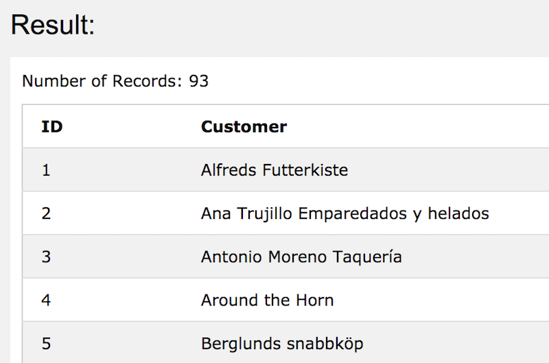

## Aliases

#### SQL aliases are used to give a table, or a column in a table, a temporary name.

> An alias only exists for the duration of the query.


#### Alias Column Syntax
```
SELECT column_name AS alias_name
FROM table_name;
```

#### Alias Table Syntax
```
SELECT column_name(s)
FROM table_name AS alias_name;
```

예시<br/>

```
SELECT CustomerID AS ID, CustomerName AS Customer
FROM Customers;
```


>Note: 중간에 띄어쓰기가 들어갈 땐 `[]` 사용.

```
SELECT CustomerName AS Customer, ContactName AS [Contact Person]
FROM Customers;
```

주소, 우편번호, 도시, 국가를 Address로 합쳐줄 때.

```
SELECT CustomerName, Address + ', ' + PostalCode + ' ' + City + ', ' + Country AS Address
FROM Customers;
```

MySQL에서 위와 같이 얻으려고 할 때는,

```
SELECT CustomerName, CONCAT(Address,', ',PostalCode,', ',City,', ',Country) AS Address
FROM Customers;
```


Aliases can be useful when:

- There are more than one table involved in a query
- Functions are used in the query
- Column names are big or not very readable
- Two or more columns are combined together


예시<br/>

```
SELECT o.OrderID, o.OrderDate, c.CustomerName
FROM Customers AS c, Orders AS o
WHERE c.CustomerName="Around the Horn" AND c.CustomerID=o.CustomerID;
```