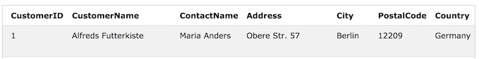
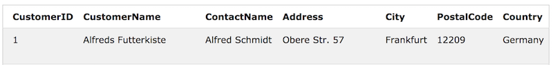

## UPDATE

#### is used to modify the existing records in a table.

	UPDATE table_name
	SET column1 = value1, column2 = value2, ...
	WHERE condition;

- 조건 하의 값들을 set 이하의 값으로 변경.

	UPDATE Customers
	SET ContactName='Alfred Schmidt', City='Frankfurt'
	WHERE CustomerID=1;

첫번째는 업데이트 전, 두번째는 업데이트 후.
여러 개를 한꺼번에 변경 가능.