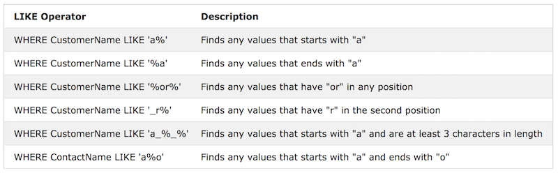

## Wildcard

#### 문자열에서 임의의 다른 문자(들)를 대체하기 위해 사용. LIKE 연산자와 함께 사용된다.

- 두 가지가 있음:<br/>
`%` represents zero, one, or multiple characters<br/>
`_` represents a single character<br/>

> Note: MS Access uses a question mark (?) instead of the underscore (_).


MS Access와 SQL Server에서는 다음과 같은 것도 사용:<br/>
[charlist] - Defines sets and ranges of characters to match<br/>
[^charlist] or [!charlist] - Defines sets and ranges of characters NOT to match


예시<br/>



```
SELECT * FROM Customers
WHERE City LIKE 'ber%';
```

위와 같이 입력하면 'Bern', 'Bergamo'와 같은 'ber'로 시작하는 도시가 검색됨.


```
SELECT * FROM Customers
WHERE City LIKE '[bsp]%';
```

b나 s, 또는 p로 시작하는 도시들이 검색됨.


```
SELECT * FROM Customers
WHERE City LIKE '[a-c]%';
```

a 내지 c로 시작하는 도시들. (a, b, c)

```
SELECT * FROM Customers
WHERE City LIKE '[!bsp]%';
```

b나 s, 또는 p로 시작하지 않는 도시들이 검색됨.
또는 아래와 같이 검색해도 b나 s, 또는 p로 시작하지 않는 도시들이 검색됨.

```
SELECT * FROM Customers
WHERE City NOT LIKE '[bsp]%';
```