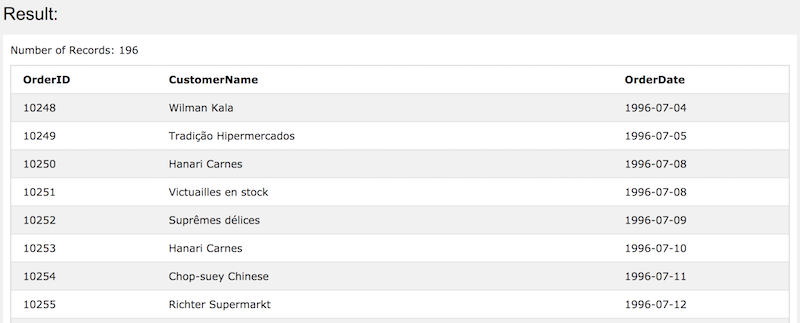
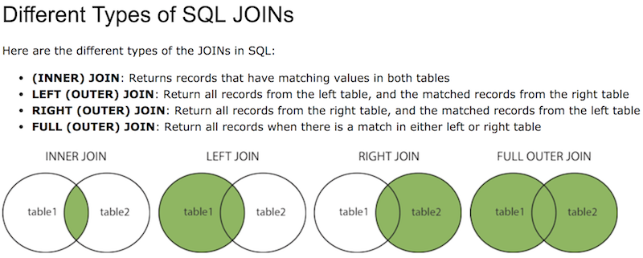
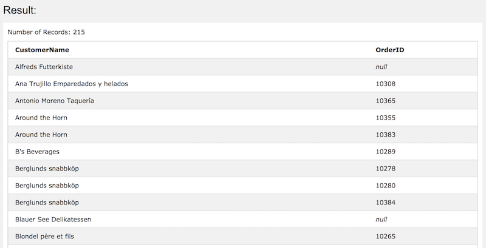
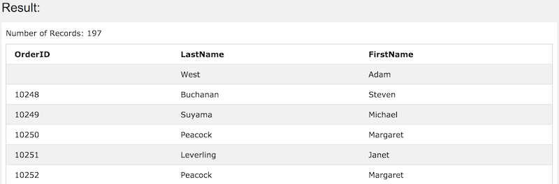
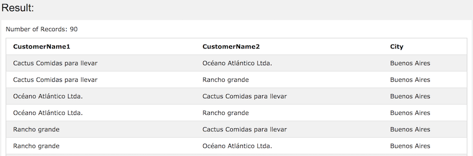

## JOIN

#### 둘 이상의 테이블로 부터 행을 합칠 때.

예시

```
SELECT Orders.OrderID, Customers.CustomerName, Orders.OrderDate
FROM Orders
INNER JOIN Customers ON Orders.CustomerID=Customers.CustomerID;
```







#### INNER JOIN Syntax

```
SELECT column_name(s)
FROM table1
INNER JOIN table2 ON table1.column_name = table2.column_name;
```


table이 세 개일 때.

```
SELECT Orders.OrderID, Customers.CustomerName, Shippers.ShipperName
FROM ((Orders
INNER JOIN Customers ON Orders.CustomerID = Customers.CustomerID)
INNER JOIN Shippers ON Orders.ShipperID = Shippers.ShipperID);
```


#### LEFT JOIN Syntax

```
SELECT column_name(s)
FROM table1
LEFT JOIN table2 ON table1.column_name = table2.column_name;
```

> Note: In some databases LEFT JOIN is called LEFT OUTER JOIN.


예시

```
SELECT Customers.CustomerName, Orders.OrderID
FROM Customers
LEFT JOIN Orders
ON Customers.CustomerID=Orders.CustomerID
ORDER BY Customers.CustomerName;
```




#### RIGHT JOIN Syntax

```
SELECT column_name(s)
FROM table1
RIGHT JOIN table2 ON table1.column_name = table2.column_name;
```


> Note: In some databases RIGHT JOIN is called RIGHT OUTER JOIN.


예시

```
SELECT Orders.OrderID, Employees.LastName, Employees.FirstName
FROM Orders
RIGHT JOIN Employees
ON Orders.EmployeeID = Employees.EmployeeID
ORDER BY Orders.OrderID;
```




#### FULL OUTER JOIN Syntax

```
SELECT column_name(s)
FROM table1
FULL OUTER JOIN table2 ON table1.column_name = table2.column_name;
```


#### Self JOIN

##### regular join, but the table is joined with itself.

##### Self JOIN Syntax

```
SELECT column_name(s)
FROM table1 T1, table1 T2
WHERE condition;
```


예시

```
SELECT A.CustomerName AS CustomerName1, B.CustomerName AS CustomerName2, A.City
FROM Customers A, Customers B
WHERE A.CustomerID <> B.CustomerID
AND A.City = B.City 
ORDER BY A.City;
```

