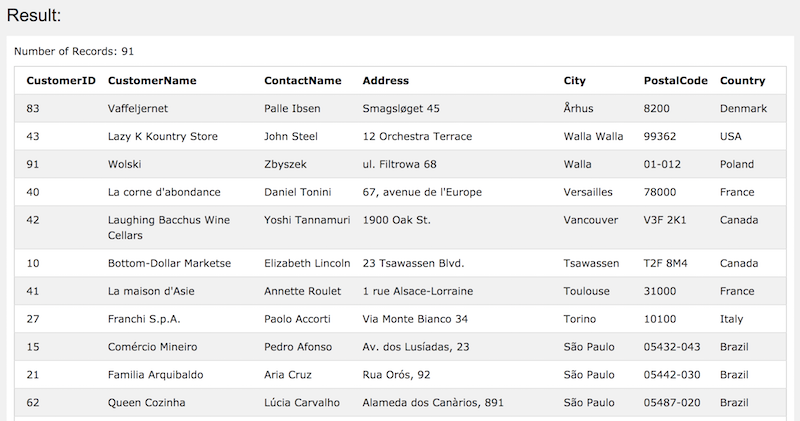
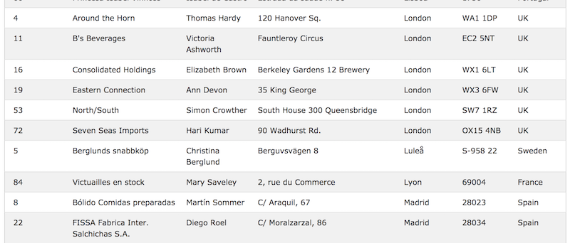
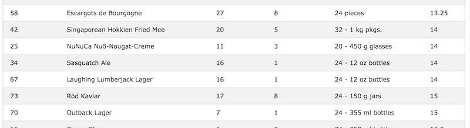

## ORDER BY Keyword

#### 결과를 오름차순 또는 내림차순으로 정리할 때 사용.

- 기본적으로 오름차순으로 정렬하며 내림차순으로 정렬하려면 DESC keyword를 사용.

```
SELECT column1, column2, ...
FROM table_name
ORDER BY column1, column2, ... ASC|DESC;
```

- 예시<br/>
```
SELECT * FROM Customers
ORDER BY Country;
```


- 끝에 `DESC`를 붙이면 내림차순 정렬<br/>
```
select * from customers
order by city DESC;
```



- 여러 개의 column으로 정리할 때
```
select * from customers
order by city, customername;
```


- 뒤에 asc를 입력하면 오름차순, desc를 입력하면 내림차순
```
select * from products
order by price asc, categoryid desc;
```
