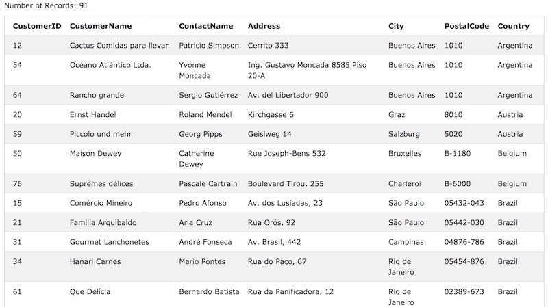

## ORDER BY Keyword

#### 결과를 오름차순 또는 내림차순으로 정리할 때 사용.

- 기본적으로 오름차순으로 정렬하며 내림차순으로 정렬하려면 DESC keyword를 사용.

```
SELECT column1, column2, ...
FROM table_name
ORDER BY column1, column2, ... ASC|DESC;
```

- 예시<br/>
```
SELECT * FROM Customers
ORDER BY Country;
```
