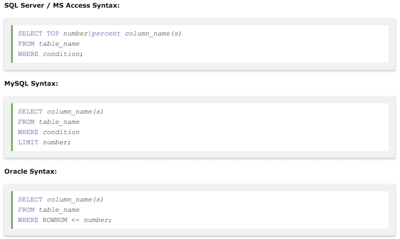

## SELECT TOP
#### 가져올 레코드의 수를 지정해 줌. 수천 개의 레코드가 있는 큰 테이블을 가져올 때 performance에 영향이 있기 때문에.

- 주의: 모든 데이터베이스 시스템이 SELECT TOP을 사용하는 것은 아니며, MySQL은 LIMIT를, Oracle은 ROWNUM을 이용.

예시<br/>



- 처음 세 개만 가져오기<br/>
```select top 3 * from customers;```<br/>
or<br/>
```SELECT * FROM Customers LIMIT 3;```<br/>
or<br/>
```SELECT * FROM Customers WHERE ROWNUM <= 3;```


- `%`를 이용하기<br/>
```select top 5 percent * from customers;```


- 여러 가지 조건들도 적용 가능.
ex.<br/>
```SELECT TOP 3 * FROM Customers WHERE Country='Germany';```<br/>
or<br/>
```SELECT * FROM Customers WHERE Country='Germany' LIMIT 3;```<br/>
or<br/>
```SELECT * FROM Customers WHERE Country='Germany' AND ROWNUM <= 3;```