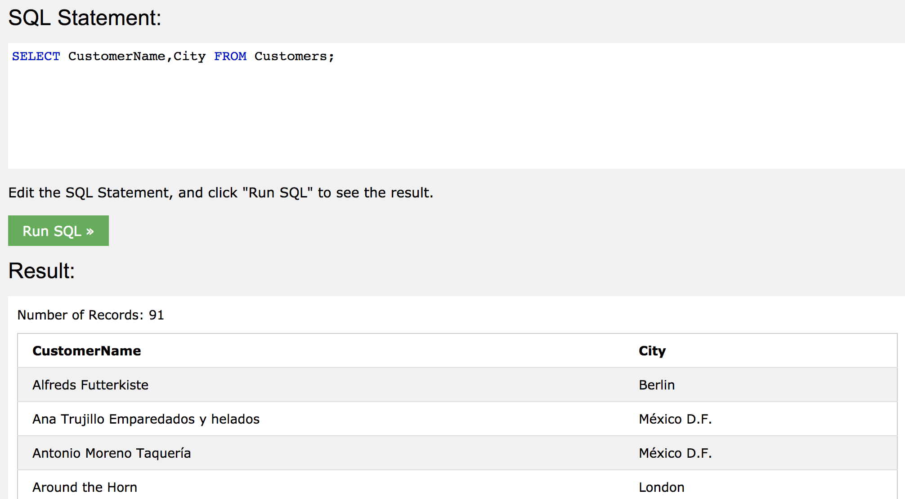
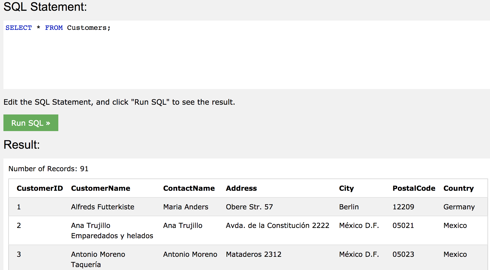
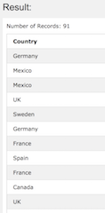
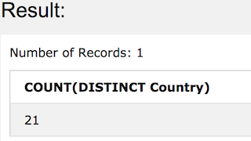
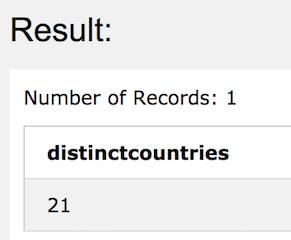

## SQL select

#### command

	SELECT column1, column2, ...
	FROM table_name;

column1, column2 자리에 데이터를 선택하고 싶은 필드 이름을 입력한다.

column은 `,`로 구별하며, 순서는 기재한 대로 나옴.

	SELECT * FROM table_name;

모든 필드를 다 선택하고 싶으면 `*`을 이용한다.


#### SQL SELECT DISTINCT Statement
 - SELECT DISTINCT statement는 별개의(중복되지 않은) 값만 return한다.<br/>
```SELECT Country FROM Customers;```<br/>
<br/>
```SELECT DISTINCT Country FROM Customers;```<br/>
<br/>
count도 적용가능하다.<br/>
```SELECT COUNT(DISTINCT Country) FROM Customers;```<br/>
<br/>
중복적용도 가능하다.<br/>
```
SELECT Count(*) AS DistinctCountries
FROM (SELECT DISTINCT Country FROM Customers);
```
<br/>
<br/>