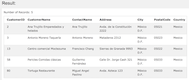
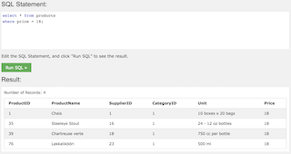
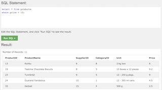

## WHERE
#### 필터링할 때 사용.
```
SELECT column1, column2, ...
FROM table_name
WHERE condition;
```
condition에 필터링할 조건을 입력
```
select * from customers
where country = 'Mexico';
```


문자는 작은 따옴표 `' '` 안에 입력하고, 숫자는 작은 따옴표가 없어야 한다.<br/>


#### 사용할 수 있는 오퍼레이터.

Operator | Description
---------|--------------
= | Equal
<> | Not equal
!= | Not equal (some version)
 > | Greater than
< | Less than
 >= | Greater than or equal
<= | Less than or equal
between | Between an inclusive range
LIKE | Search for a pattern
IN | To specify multiple possible values for a column

